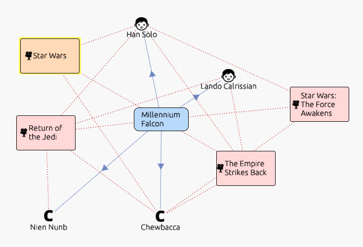

# RDFGlance

RDFGlance is an open-source application designed to provide a visual representation of RDF (Resource Description Framework) data. The application is programmed using Rust, ensuring high performance and safety.

- Easy to install
- Small Desktop App
- 100% React free
- Multithread Processing to use 100% of your CPU power
- No HTML
- No Server needed
- Programmed by real programmer with real programming language
- The self-contained executable is only 15MB!
- Zero runtime needed

Try [Rdfglance WASM version](https://xdobry.github.io/rdfglance/) directly in your browser.
The WASM version does not offer all functionality. Especially no multithread non-blocking processing.

## Description

RDFGlance allows users to easily visualize and interact with RDF data. 
It is RDF Visualization tool.
It provides a user-friendly interface to explore the relationships and properties within RDF datasets in different ways: as visual interactive graph, table or data sheet.
The application is suitable for developers, researchers, and anyone interested in working with semantic web technologies.

My primary goal was to ensure the program runs as fast as possible and maintains high performance even when handling large datasets.
Therefore, the program has been optimized to efficiently process and manage large number of triples and records.


Individually styled visualization of nodes and edges



[Manual](documentation/manual.md)

## Features

RDFGlance offers the following visualization capabilities for RDF data:

- Visual interactive graph
- data tables organized by instance types.
- You can navigate the nodes like in browser from node to node.
- Display of statistical information about types, data properties, and references, sorted by type

The RDF Data can be loaded by using following formats:

- ttl
- rdf/xml
- trig - named graphs are ignored
- nt (n-tuples)
- nq (n-quads) - named graphs are ignored

Defined prefixes are taken from the input file if possible.

The program assumes that the RDF nodes (tripples) are organized using RDFS (RDF Schema).
So every node have a assigned rdf type. The program index and show all data using these types.

Some features of RDF are not supported very well. This includes:

- named graphs
- RDF list (you may resolve the lists to simple predicates. The order are preserved)

I hope to improve it in later versions.
You may use github issue system to report bug and feature wishes.

## Compilation

To compile RDFGlance, you need to have [Rust installed](https://www.rust-lang.org/tools/install) on your system. Follow these steps to compile the application:

1. Clone the repository:
  ```sh
  git clone https://github.com/xdobry/rdfglance.git
  cd rdfglance
  ```

2. Build the application using Cargo:
  ```sh
  cargo build --release
  ```

3. The compiled binary will be located in the `target/release` directory.

You may also pick the precompiled executable for windows from [github releases](https://github.com/xdobry/rdfglance/releases).

## Usage

After compiling the application, you can run it using the following command:
```sh
./target/release/rdf-glance
```

For more information on how to use RDFGlance, refer to the documentation provided in the [repository](documentation/manual.md).

## Wasm Web Application Build

Prepare wasm

  ```sh
  rustup target add wasm32-unknown-unknown
  cargo install trunk
  ```

  ```sh
  cargo build --target wasm32-unknown-unknown
  ```

Run server in dev mode

  ```sh
  trunk serve
  ```
  
Build static web content. Output in dist folder

  ```sh
  trunk build
  ```

Build for github pages

  ```sh
  trunk build --release --public-url /rdfglance/
  ```


The last web release is avaiable here [Rdfglance WASM version](https://xdobry.github.io/rdfglance/)

You need to configure vs code to switch to wasm mode by Ctrl-Shift-P + Preferences Open User Settings (JSON). Add option

     "rust-analyzer.cargo.target": "wasm32-unknown-unknown",


## Known Problems

- Some RDF files can not be read. You will see the error messages in the std output. It seems that the used oxrdf parser is quite sensitive.
- If loading big rdf files the gui may freeze for a while. There is no separate worker thread for it
- The is no limitations to shown size of elements in visual graph. If you have more than 10000 Elements the ui may be not very responsible

I still hope that the application can be useful for others.
Maybe I will improve it later if I feel like it again.
It is really difficult to achieve a good state.

## Technology

RDFGlance leverages the `egui` library, a simple and fast GUI library for Rust that can create both desktop and web applications using WebAssembly (Wasm).
Unlike traditional web applications that rely on HTML and React, `egui` allows for a more lightweight and efficient approach. This results in a smaller application size and improved performance, enabling RDFGlance to handle and display larger RDF datasets, up to 100,000 triples, without any delays.

RDFGlance uses some oxigraph rust libraries. 

I have developed the application because my frustration about low performance of existing rdf solutions and I wanted to learn and test Rust and egui framework.
It is a learning and hobby project.

## Releases

You can use ready to use binaries for windows see [github releases](https://github.com/xdobry/rdfglance/releases) 

## Contributing

We welcome contributions from the community. If you would like to contribute to RDFGlance, please fork the repository and submit a pull request. Make sure to follow the contribution guidelines outlined in the repository.
You can also create [github issue](https://github.com/xdobry/rdfglance/issues)

## License

RDFGlance is licensed under the GPL License. See the `LICENSE` file for more details.